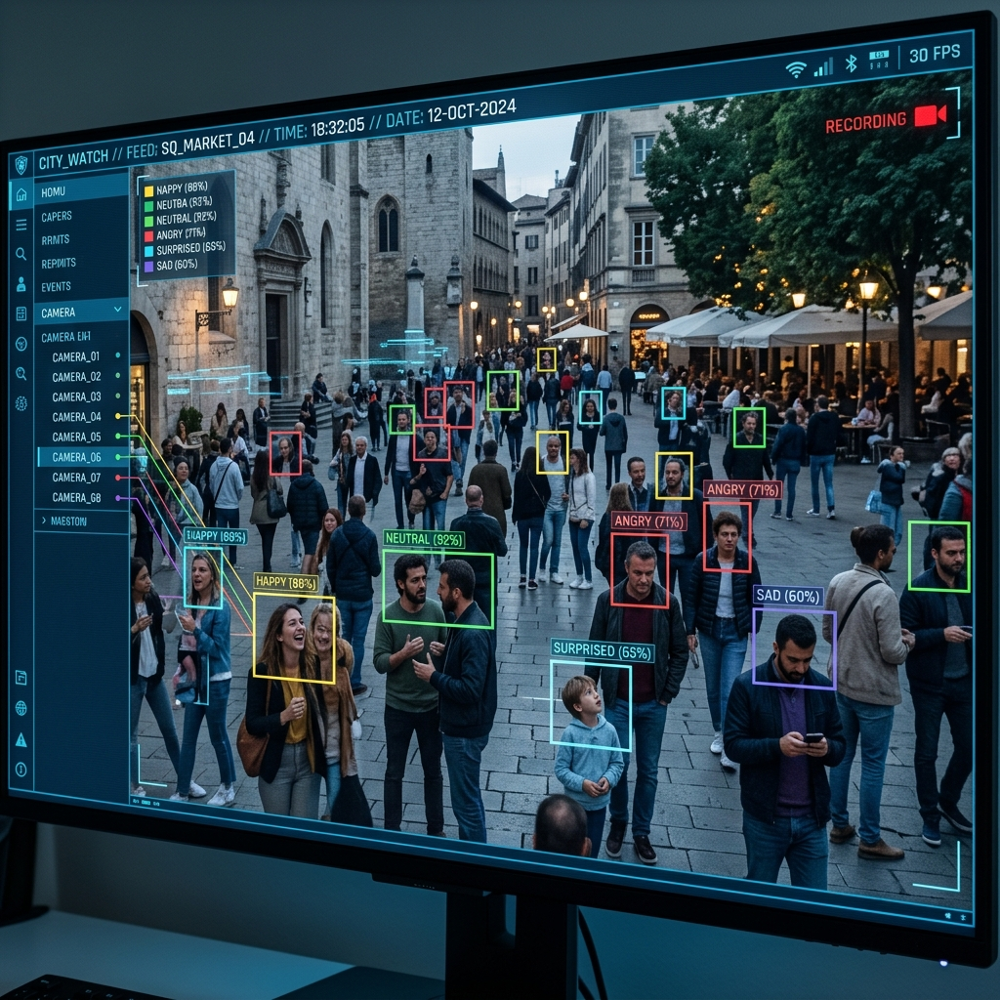
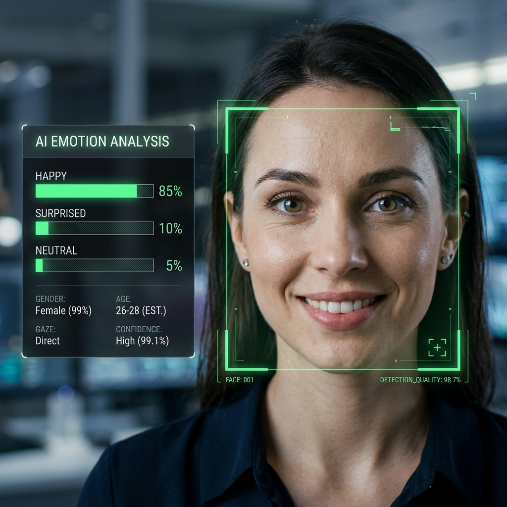
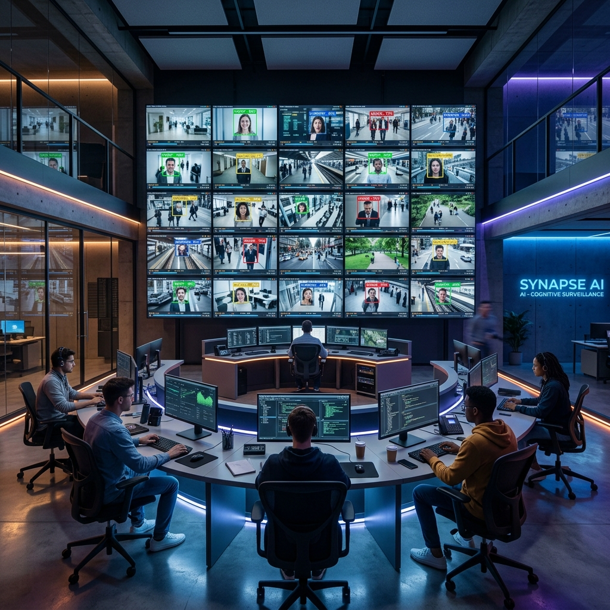

# 🧠 Crowd Behavior & Emotion Analyzer (Real-Time)

A high-performance, real-time facial emotion analysis and crowd density tracking system. This project leverages state-of-the-art computer vision models to analyze RTSP network streams or local camera feeds, providing instant insights into human behavior and crowd dynamics.

---

## 🚀 Tech Stack

- **Core Logic**: [Python 3.11](https://www.python.org/)
- **Computer Vision**: [OpenCV (Open Source Computer Vision Library)](https://opencv.org/)
- **Deep Learning Framework**: [TensorFlow](https://www.tensorflow.org/) & [DeepFace](https://github.com/serengil/deepface)
- **Face Detection**: OpenCV SSD (Single Shot MultiBox Detector) with ResNet-10 (Caffe Model)
- **Data Handling**: [NumPy](https://numpy.org/) & [JSON](https://www.json.org/)
- **Network Streaming**: RTSP (Real-Time Streaming Protocol)

---

## 📸 Gallery

| | | | |
| :---: | :---: | :---: | :---: |
|  |  |  |  |
| *Real-time Tracking* | *Emotion Analytics* | *Detailed Person Analysis* | *Multi-Stream Monitoring* |
| | | | |

---

## ✨ Key Features

- **⚡ Zero-Latency Stream**: Asynchronous frame grabbing eliminates RTSP buffering lag.
- **🎯 High-Accuracy Detection**: Uses a DNN SSD model for robust face detection across various angles and lighting.
- **🔄 Multi-Threaded Analysis**: Emotion analysis runs in background threads, ensuring the UI remains smooth (60+ FPS).
- **📊 Adaptive UI**:
    - **Single Person Mode**: Shows a detailed percentage breakdown of all 7 primary emotions.
    - **Crowd Mode**: Displays a high-level summary of crowd density and dominant emotion counts.
- **📝 Automated Reporting**: Generates both `.md` (human-readable) and `.json` (data-ready) reports on exit.
- **⌨️ Graceful Exit**: Supports `Ctrl+C` and `q` for safe shutdown and report finalization.

---

## 🛠️ Installation & Setup

1. **Clone the Project**:
   ```bash
   git clone https://github.com/your-username/CrowdDensity_BehaviourAnalysis.git
   cd CrowdDensity_BehaviourAnalysis
   ```

2. **Run the One-Click Launcher**:
   Simply double-click `start.bat`. This will:
   - Check for Python installation.
   - Install all required dependencies (`opencv-python`, `deepface`, `tensorflow`, `numpy`).
   - Launch the application.

---

## ⚙️ How It Works

### 1. The Pipeline
1. **Frame Capture**: An async thread pulls the latest frame from the RTSP stream.
2. **Face Detection**: The frame is passed to the SSD Caffe model to find all faces.
3. **Tracking**: A centroid-based tracker assigns and maintains unique IDs for every person.
4. **Emotion Analysis**: Cropped faces are queued for the `DeepFace` workers.
5. **Visualization**: Colorful bounding boxes and text overlays are drawn on the frame.
6. **Reporting**: Behavioral history is stored in memory and flushed to files upon closing.

### 2. The Tech Magic
- **SSD Face Detection**: Unlike Haar Cascades, the SSD model is much more resistant to rotation and occlusion.
- **Thread Safety**: Uses `queue.Queue` to safely pass frames between the capture thread, main thread, and worker threads.

---

## 📂 Project Structure

- `emotion_analyzer.py`: Main logic, UI, and tracking.
- `start.bat`: automated environment setup and launcher.
- `deploy.prototxt` & `res10_300x300...caffemodel`: Pre-trained face detection weights.
- `analysis_report.json`: Historical behavioral data.
- `analysis_report.md`: Summarized human-readable report.
- `gallery/`: Visual documentation and demo screenshots.

---

## 📜 License
MIT License. Feel free to use and modify for your own AI projects!
